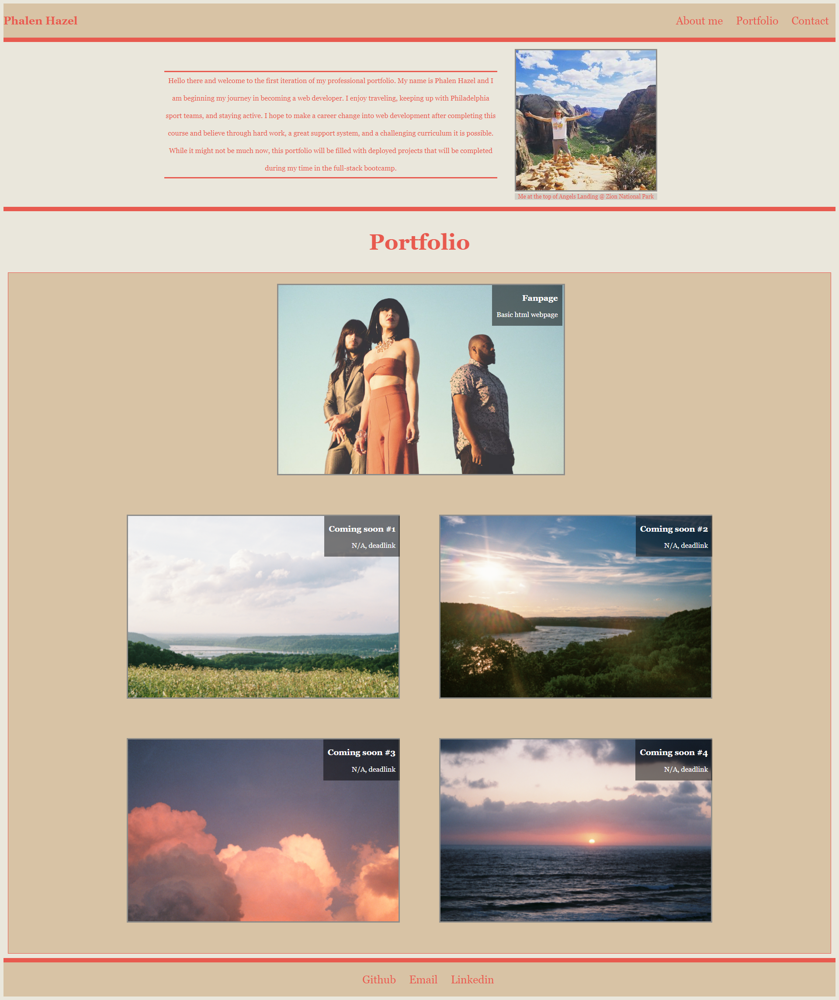

# starter-portfolio

## Description

This will be the first iteration of my professional portfolio in addition to being my week 2 homework assignment for the fall part time full stack coding bootcamp. I have limited experience with coding and I haven't created any projects to place in my portfolio, so it will primarily be filled with placeholder images and names which I plan on later filling in as I create and work on new projects.

## Technology Utilized

This portfolio will be based off HTML and CSS files as for right now with the likelyhood of integrating javascript and other technologies along the way

Some tools that we've learned recently that will be included in this portfolio include

* CSS variables
* flexbox
* media queries

## Objective

The objective is to create a responsive portfolio page that highlights my best work as a developer and provides insight to potential employers of the projects that I've worked on in the past and what I'm capable of as a web developer. Cheers!

<!-- TODO: add a screenshot of the portfolio and a link to the deployed portfolio -->
## Submission

Check out my portfolio here: [Click here to view my portfolio!](https://phalenh.github.io/starter-portfolio/main/index.html)

